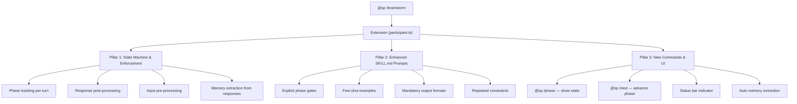

# SP Superpowers — Hookless Workaround Plan

> [!IMPORTANT]
> **Problem:** GitHub Copilot Business in corporate environments disables preview features (hooks). Without hooks, the 4 Python scripts that enforce workflow constraints, inject memory, warn about code keywords, and extract memory markers **do not run**. The result: GPT-4 reads SKILL.md but doesn't follow it strictly — it asks questions but skips phase transitions, doesn't create spec documents, and doesn't enforce "no code" during brainstorming.

---

## What Hooks Were Doing (and What Breaks Without Them)

| Hook | Script | Purpose | Impact Without It |
|------|--------|---------|-------------------|
| `SessionStart` | [inject-memory.py](file:///c:/DockerVolumes/superpower-vscode-insider/scripts/inject-memory.py) | Inject memory at session start | ✅ **Already handled** by [loadMemory()](file:///c:/DockerVolumes/superpower-vscode-insider/extension/src/participant.ts#169-198) in extension |
| `PreToolUse` | [pre-tool-use.py](file:///c:/DockerVolumes/superpower-vscode-insider/scripts/pre-tool-use.py) | Block `writeFile`/`editFile` in brainstorming | ❌ LLM can write code freely during planning |
| `UserPromptSubmit` | [user-prompt-submit.py](file:///c:/DockerVolumes/superpower-vscode-insider/scripts/user-prompt-submit.py) | Warn when user types code keywords | ❌ No guardrails on user input |
| `Stop` | [extract-memory.py](file:///c:/DockerVolumes/superpower-vscode-insider/scripts/extract-memory.py) | Extract `<!-- MEMORY: ... -->` markers from transcript | ❌ Memory never persists between sessions |

---

## Solution Architecture: 3 Pillars



---

## Pillar 1: Extension as the Enforcement Layer

> Move ALL hook logic into [participant.ts](file:///c:/DockerVolumes/superpower-vscode-insider/extension/src/participant.ts). The extension becomes the single enforcement point.

### 1.1 Skill Phase State Machine

**File:** [participant.ts](file:///c:/DockerVolumes/superpower-vscode-insider/extension/src/participant.ts)

Add a state machine that tracks the current phase within each skill. For brainstorming, the phases are:

```typescript
interface SkillState {
    skillName: string;
    phase: string;           // e.g. "questioning", "approaches", "design", "spec", "transition"
    turnCount: number;        // turns within current phase
    totalTurns: number;       // total turns in this skill session
    specCreated: boolean;     // whether a spec document was produced
    startedAt: string;        // ISO timestamp
}

const BRAINSTORM_PHASES = {
    questioning: { minTurns: 2, maxTurns: 6, next: 'approaches' },
    approaches:  { minTurns: 1, maxTurns: 2, next: 'design' },
    design:      { minTurns: 1, maxTurns: 3, next: 'spec' },
    spec:        { minTurns: 1, maxTurns: 1, next: 'transition' },
    transition:  { minTurns: 1, maxTurns: 1, next: null },
};
```

**How it works:**
- On first turn of `@sp /brainstorm`, initialize state = `{ phase: 'questioning', turnCount: 0 }`
- Each turn, increment `turnCount` 
- When `turnCount >= maxTurns` for current phase, inject a phase-advance prompt:
  - `"You have asked enough clarifying questions. NOW you MUST propose 2-3 approaches with trade-offs. Do NOT ask more questions."`
- Track phase transitions by scanning LLM response for phase markers

### 1.2 Phase-Aware Context Injection

Each turn, the extension injects a **phase-specific reminder** into the LLM context based on current state:

```typescript
function getPhaseReminder(state: SkillState): string {
    if (state.skillName !== 'brainstorming') return '';
    
    const reminders: Record<string, string> = {
        questioning: `
🔒 PHASE: Clarifying Questions (Turn ${state.turnCount}/${BRAINSTORM_PHASES.questioning.maxTurns})
RULES:
- Ask exactly ONE question per message
- Do NOT write any code, scripts, or implementation
- Do NOT propose approaches yet — gather requirements first
- End your message with your question, nothing else`,
        
        approaches: `
🔒 PHASE: Propose Approaches (Turn ${state.turnCount})
RULES:
- Present 2-3 approaches with trade-offs
- Lead with your recommendation
- Do NOT write any code
- Ask the user which approach they prefer`,
        
        design: `
🔒 PHASE: Present Design (Turn ${state.turnCount})  
RULES:
- Present the detailed design based on chosen approach
- Cover: architecture, components, error handling, testing strategy
- Do NOT write any code
- Get approval on each section before proceeding`,
        
        spec: `
🔒 PHASE: Write Spec Document
YOU MUST create a markdown spec document and save it to docs/superpowers/specs/
Format: YYYY-MM-DD-<topic>-design.md
Include all design decisions from the conversation.
After writing, ask user to review.`,
        
        transition: `
🔒 PHASE: Transition
YOU MUST output EXACTLY this message:
"Design is complete! To proceed with implementation, type @sp /write-plan to create the implementation plan."
Do NOT start implementing. Do NOT write code.`,
    };
    
    return reminders[state.phase] || '';
}
```

### 1.3 Response Post-Processing

After receiving the LLM response, scan and enforce:

```typescript
async function processResponse(
    responseText: string, 
    state: SkillState, 
    stream: vscode.ChatResponseStream
): Promise<string> {
    
    // 1. Extract and save memory markers immediately
    extractAndSaveMemory(responseText);
    
    // 2. Code detection in no-code phases
    if (['brainstorming', 'writing-plans'].includes(state.skillName)) {
        if (isInNoCodePhase(state)) {
            const codeBlockPattern = /```[\s\S]*?```/g;
            const codeBlocks = responseText.match(codeBlockPattern);
            if (codeBlocks && containsRealCode(codeBlocks)) {
                // Append a warning to the stream
                stream.markdown('\n\n> ⚠️ **Phase violation detected.** Code was generated during the planning phase. Please focus on design decisions, not implementation.\n');
            }
        }
    }
    
    // 3. Phase transition detection
    detectAndAdvancePhase(responseText, state);
    
    return responseText;
}
```

### 1.4 Input Pre-Processing (Replaces user-prompt-submit hook)

Before sending the user's prompt to the LLM, scan for code keywords and inject a warning:

```typescript
function preprocessUserPrompt(prompt: string, state: SkillState): string {
    if (!['brainstorming', 'writing-plans'].includes(state.skillName)) {
        return prompt;
    }
    
    const codeKeywords = /\b(function|def|class|import|implement|build|create_file|write_file)\b/i;
    if (codeKeywords.test(prompt)) {
        return `[SYSTEM WARNING: The user's message contains code-related keywords, but you are in ${state.phase} phase. Do NOT generate code. Redirect the conversation back to design/planning.]\n\nUser message: ${prompt}`;
    }
    
    return prompt;
}
```

### 1.5 Memory Extraction from Responses (Replaces stop hook)

Extract `<!-- MEMORY: {...} -->` markers from every LLM response and write to disk immediately:

```typescript
function extractAndSaveMemory(responseText: string): void {
    const memoryPattern = /<!--\s*MEMORY:\s*(\{.*?\})\s*-->/gs;
    const memoryRoot = getMemoryRoot();
    let match;
    
    while ((match = memoryPattern.exec(responseText)) !== null) {
        try {
            const marker = JSON.parse(match[1]);
            if (marker.type && marker.content && marker.file) {
                writeMemoryToDisk(memoryRoot, marker);
            }
        } catch { /* skip invalid JSON */ }
    }
}
```

---

## Pillar 2: Bulletproof Prompt Engineering

> [!TIP]
> The #1 reason GPT-4 doesn't follow the workflow strictly is that the current SKILL.md files are **too soft**. They use language like "Do NOT write code" once, but don't repeat it, don't provide examples of correct behavior, and don't define mandatory output formats.

### 2.1 Rewrite Brainstorming SKILL.md

Key changes to [SKILL.md](file:///c:/DockerVolumes/superpower-vscode-insider/skills/brainstorming/SKILL.md):

**Add at the TOP of the file (before any other instructions):**

```markdown
## ⛔ CRITICAL CONSTRAINTS — READ BEFORE ANYTHING ELSE

1. You MUST NOT generate ANY code (no code blocks, no scripts, no snippets)
2. You MUST ask exactly ONE question per message during the questioning phase
3. You MUST create a spec document before transitioning — no exceptions
4. You MUST end with the EXACT transition phrase (see Phase 6)
5. You MUST follow the phases IN ORDER — do not skip phases
6. If the user asks you to write code, REFUSE and redirect to design discussion

VIOLATION OF THESE RULES IS A CRITICAL FAILURE.
```

**Add explicit phase markers and example outputs:**

```markdown
### Phase 1: Explore Context (1 turn)

Output format — you MUST produce exactly this structure:
---
> 📋 **Project Context**
> - Current branch: `[branch name]`
> - Recent commits: [summary of last 3-5 commits]
> - Key files: [relevant files you can see]
>
> Based on this context, my first question is:
> 
> **[Your question here]?**
---

### Phase 2: Clarifying Questions (2-5 turns)

Output format — each turn MUST be exactly:
---
> Thank you for that clarification. [Brief acknowledgment of what you learned]
>
> **Question [N]: [Your next question]?**
> 
> Options:
> - A) [Option A]
> - B) [Option B]  
> - C) [Option C]
---

### Phase 3: Propose Approaches (1 turn)

When you have enough information, you MUST propose approaches:
---
## Proposed Approaches

### Approach 1: [Name] ⭐ (Recommended)
**Description:** [2-3 sentences]
**Pros:** [list]
**Cons:** [list]

### Approach 2: [Name]
**Description:** [2-3 sentences]  
**Pros:** [list]
**Cons:** [list]

**My recommendation is Approach [N] because [reason].**
**Which approach do you prefer, or would you like to modify one?**
---

### Phase 4: Present Design (1-3 turns)
[... detailed section with exact output format ...]

### Phase 5: Write Spec Document (1 turn)
YOU MUST create a file at: docs/superpowers/specs/YYYY-MM-DD-<topic>-design.md
YOU MUST commit it with message: "docs: add <topic> design spec"

### Phase 6: Transition (1 turn)
YOU MUST output EXACTLY this and NOTHING ELSE:
---
✅ **Design Complete!**

The spec has been saved to `docs/superpowers/specs/[filename]`.

**To proceed with implementation, type: `@sp /write-plan`**
---
```

### 2.2 Similar Treatment for All Skills

Apply the same pattern to:
- [writing-plans/SKILL.md](file:///c:/DockerVolumes/superpower-vscode-insider/skills/writing-plans/SKILL.md) — Explicit plan format, mandatory file creation, exact transition message
- [executing-plans/SKILL.md](file:///c:/DockerVolumes/superpower-vscode-insider/skills/executing-plans/SKILL.md) — Checkpoint format, pause format, completion format
- All other skills — Add `## ⛔ CRITICAL CONSTRAINTS` section

### 2.3 Add "Anti-Pattern" Examples

In each SKILL.md, add a section showing what NOT to do:

```markdown
## ❌ Anti-Patterns — Do NOT Do These

BAD (generating code during brainstorming):
> "Here's how we could implement this:"
> ```python
> def my_function(): ...
> ```

BAD (skipping the spec document):
> "Great, I think we have a good design. Let me start implementing..."

BAD (not following the transition format):
> "Should I start coding now?"

GOOD (asking a clarifying question):
> "**Question 3:** What volume of data are we expecting per day?"
> Options:
> - A) Under 1GB
> - B) 1-10GB
> - C) Over 10GB
```

---

## Pillar 3: New Extension Commands & UI

### 3.1 New Slash Commands

Add these commands to the `@sp` participant:

| Command | Purpose |
|---------|---------|
| `@sp /phase` | Show current skill, phase, and turn count |
| `@sp /next` | Manually advance to the next phase |
| `@sp /reset` | Reset skill state (clear active skill) |
| `@sp /memory save` | Force memory extraction from last response |
| `@sp /help` | List all commands with current state |

### 3.2 Status Bar Item

Add a VS Code status bar item that shows the current skill and phase:

```
✨ SP: brainstorming → questioning (turn 3/6)
```

This provides visual feedback even without hooks.

### 3.3 Conversation State Persistence

Store conversation state in a file so it survives VS Code restarts:

```
~/.copilot/sp-state.json
{
    "skillName": "brainstorming",
    "phase": "questioning", 
    "turnCount": 3,
    "totalTurns": 3,
    "specCreated": false,
    "startedAt": "2026-04-08T11:00:00Z"
}
```

---

## Implementation Order

### Phase 1: Core Enforcement (Highest Impact) 🔴

These changes deliver 80% of the value with 20% of the effort:

| # | Task | File | Est. Time |
|---|------|------|-----------|
| 1 | Add `SkillState` interface and state machine | [participant.ts](file:///c:/DockerVolumes/superpower-vscode-insider/extension/src/participant.ts) | 30 min |
| 2 | Add phase-aware context injection | [participant.ts](file:///c:/DockerVolumes/superpower-vscode-insider/extension/src/participant.ts) | 30 min |
| 3 | Rewrite brainstorming SKILL.md with phase gates | [brainstorming/SKILL.md](file:///c:/DockerVolumes/superpower-vscode-insider/skills/brainstorming/SKILL.md) | 45 min |
| 4 | Add input pre-processing (code keyword detection) | [participant.ts](file:///c:/DockerVolumes/superpower-vscode-insider/extension/src/participant.ts) | 20 min |
| 5 | Add memory extraction from responses | [participant.ts](file:///c:/DockerVolumes/superpower-vscode-insider/extension/src/participant.ts) | 30 min |

### Phase 2: Enhanced Skills (Medium Impact) 🟡

| # | Task | File | Est. Time |
|---|------|------|-----------|
| 6 | Rewrite writing-plans SKILL.md | [writing-plans/SKILL.md](file:///c:/DockerVolumes/superpower-vscode-insider/skills/writing-plans/SKILL.md) | 30 min |
| 7 | Rewrite executing-plans SKILL.md | [executing-plans/SKILL.md](file:///c:/DockerVolumes/superpower-vscode-insider/skills/executing-plans/SKILL.md) | 30 min |
| 8 | Add anti-patterns to all skills | All SKILL.md files | 45 min |
| 9 | Add response post-processing (code detection) | [participant.ts](file:///c:/DockerVolumes/superpower-vscode-insider/extension/src/participant.ts) | 30 min |

### Phase 3: UX Improvements (Nice to Have) 🟢

| # | Task | File | Est. Time |
|---|------|------|-----------|
| 10 | Add `/phase`, `/next`, `/reset` commands | [participant.ts](file:///c:/DockerVolumes/superpower-vscode-insider/extension/src/participant.ts), [package.json](file:///c:/DockerVolumes/superpower-vscode-insider/extension/package.json) | 45 min |
| 11 | Add status bar indicator | [extension.ts](file:///c:/DockerVolumes/superpower-vscode-insider/extension/src/extension.ts) | 20 min |
| 12 | Add state persistence to disk | [participant.ts](file:///c:/DockerVolumes/superpower-vscode-insider/extension/src/participant.ts) | 20 min |
| 13 | Rebuild and test VSIX | `extension/` | 15 min |

**Total estimated time: ~6 hours**

---

## Risk Assessment

| Risk | Severity | Mitigation |
|------|----------|------------|
| GPT-4 still ignores constraints despite enhanced prompts | Medium | Phase-aware injection adds constraints every turn; response post-processing catches violations |
| Response post-processing catches false positives (e.g., markdown in specs that looks like code) | Low | Only flag actual programming language code blocks, not markdown |
| State machine gets out of sync with conversation | Medium | `/reset` command; state persisted to disk; auto-reset on new skill invocation |
| Memory extraction regex misses markers | Low | Same regex as existing Python script; well-tested pattern |
| Performance impact of response scanning | Very Low | Regex scanning of response text is negligible |

---

## Key Insight

> [!NOTE]
> The fundamental shift is: **hooks were external enforcement** (the system blocked the LLM). Without hooks, we need **internal enforcement** (the extension shapes what the LLM sees and validates what it produces). The extension becomes both the **pre-processor** (injecting phase constraints) and **post-processor** (detecting violations and extracting memory) — wrapping the LLM in a enforcement sandwich.
> 
> The SKILL.md enhancements are the "soft" layer (persuasion), while the extension's state machine is the "hard" layer (enforcement). Together, they replicate ~90% of what hooks provided.
